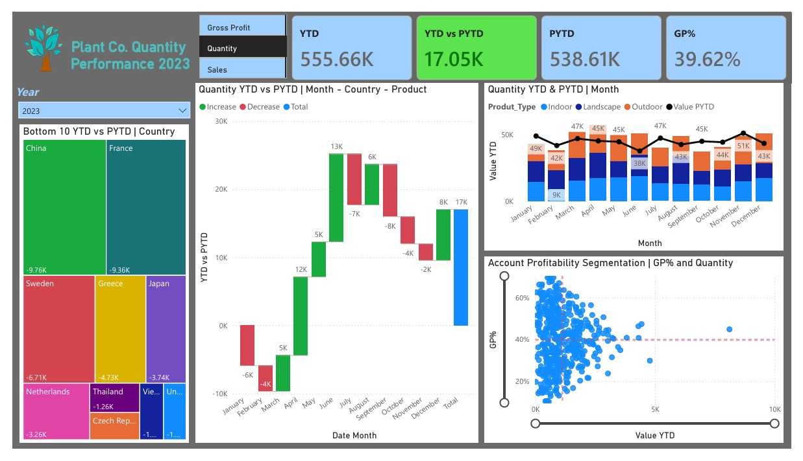

# Plant Sales Analysis - Power BI Report

## Overview
This Power BI project involves analyzing plant sales data to identify key trends, performance metrics, and actionable insights. The report includes various interactive visualizations that provide a comprehensive view of sales performance.

## Objectives
- Determine the top-performing and bottom-performing plants.
- Analyze sales trends over specific time periods.
- Evaluate the impact of different variables on overall sales performance.
- Provide insights and recommendations for business improvement.

## Tools and Technologies
- **Power BI**: For creating interactive data visualizations and dashboards.
- **SQL**: For querying and manipulating data.
- **Excel**: For initial data cleaning and transformation.

## Key Features and Visualizations
### Cards:
- **YTD (Year-To-Date)**: Displays the current year's total sales.
- **PYTD (Previous Year-To-Date)**: Shows the sales for the same period in the previous year.
- **YTD vs PYTD**: Compares current year sales with the previous year’s sales for the same period.
- **GP% (Gross Profit Percentage)**: Indicates the gross profit margin.

### Slicers:
- **Metric Selector**: Allows switching between Gross Profit, Quantity, and Sales.
- **Year Selector**: Enables filtering data for the years 2023 and 2024.

### Charts and Visualizations:
- **Treemap**: Visualizes the bottom 10 countries by YTD vs PYTD performance, highlighting areas with the greatest decline or slowest growth.
- **Waterfall Chart**: Illustrates YTD vs PYTD differences with drill-down capabilities into month, country, and product, providing detailed insights into performance drivers.
- **Line and Stacked Column Chart**: Displays YTD and PYTD metrics by month and product name, showing trends and performance comparisons over time.
- **Scatter Chart**: Plots account profitability segmentation based on GP% and YTD, allowing for easy identification of high-profit and low-profit accounts.

## Methodology
1. **Data Cleaning**: Utilized Excel to remove duplicates, correct errors, and standardize data formats.
2. **Data Import**: Imported cleaned data into Power BI.
3. **Data Transformation**: Created calculated columns and measures in Power BI for advanced analysis.
4. **Visualization**: Developed various interactive charts and dashboards to visualize sales performance and trends.
5. **Analysis**: Conducted in-depth analysis to identify key insights and patterns in the data.

## Findings and Insights
- **Top-Performing Plants**: Identified plants with the highest sales and growth rates.
- **Sales Trends**: Observed significant sales peaks during certain months, indicating seasonal demand.
- **Product Category Performance**: Determined which product categories contribute the most to total sales.
- **Regional Insights**: Highlighted regions with consistent sales performance, suggesting potential areas for expansion.
- **Conversion Rates**: Analyzed the sales funnel to identify stages with the highest drop-off rates.

## Screenshot

## How to Use
1. Download the `report.pbix` file from this repository.
2. Open the file in **Microsoft Power BI Desktop**.
3. Interact with the dashboard to explore insights.

## Installation
To view and modify the report, ensure you have:
- **Power BI Desktop** installed ([Download here](https://powerbi.microsoft.com/desktop/))
- The necessary dataset files (if applicable).

## Contributing
Feel free to contribute by submitting pull requests or reporting issues. Suggestions for enhancements are always welcome!

